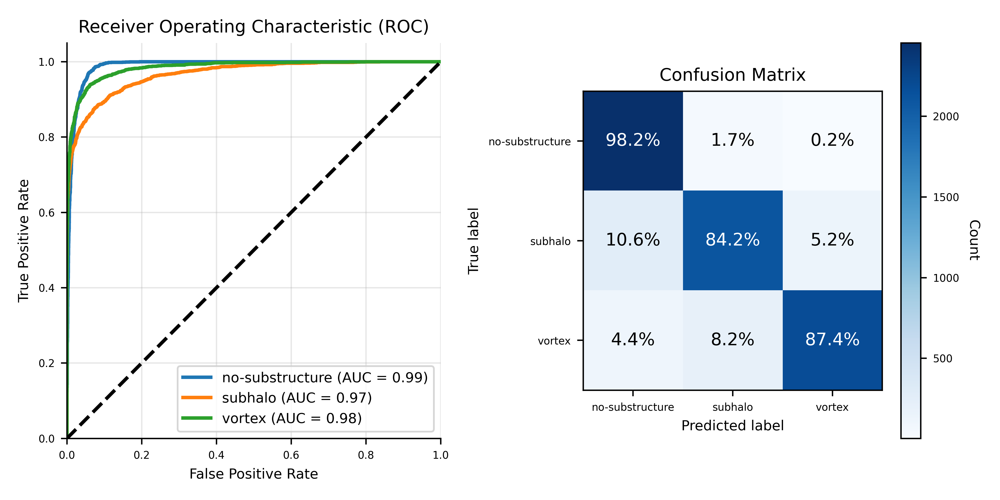
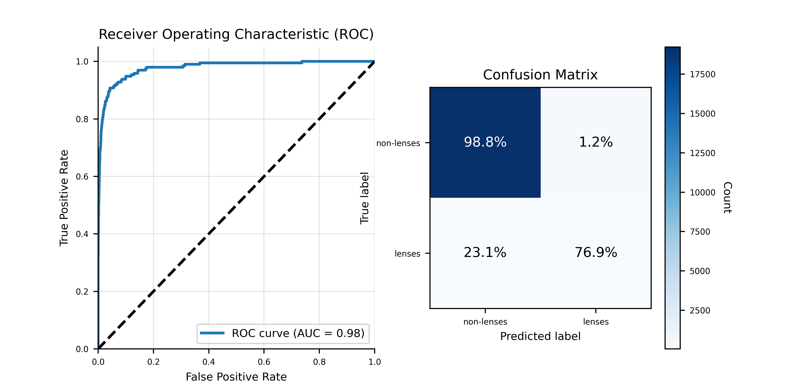

# DeepLense - Lens Finding (GSoC 2025)
This repository contains implementations for the tests associated with DeepLense - Lens Finding, a project of GSoC 2025.

### Structure
```
├── src/                  # Source code
│   ├── data/             # Helpers for dataloaders and datasets
│   ├── training/         # A Solver class implementing training logic
│   ├── hparam.tuning.py  # Module implementing model selection logic
│   └── utils.py          # Utility functions for plots and visualization
```

### Setup
```
conda create -n lensfinding python=3.12
conda activate lensfinding
pip install -r requirements.txt
pip install -e .
```

### Common Test I. Multi-class Classification
The task required to build a model to solve a multi-class classification problem on strong lensing images with different substructures. See `multiclass_classification.ipynb` notebook.

*Architecture.* For simplicity, we employ a relatively small ResNet18 [1], a Convolutional Neural Network (CNN) with identity mappings. Indeed, more complex architectures (e.g., DenseNets, ViTs) would have probably provided better performance. However, for the scope of this task, and to save computational resources both during model selection and training, we didn't consider the trade-off worth it.

*Methodology.* Model selection is carried out by means of grid-search. The model is trained and evaluated on an $80$-$20$ train-val split. The splits are obtained via stratified splitting on the original training set. The explored hyperparameters include the learning rate and a learning rate decay, which is used within a linear decay learning rate scheduler. Additionally, we separately test two configurations where the dataset is either applied or not applied a square-root stretch, to (possibly) enhance features with lower surface brightness [2]. The model is trained for at most $100$ training epochs. An early-stopping mechanism with patience of $10$ epochs is employed to halt training when validation performance does not improve anymore. The results are averaged across $5$ trials.

Finally, when model selection is concluded, we take the best identified configuration and perform a final retraining on the entire training set, and evaluate on the test set.

*Results.* Below, we provide a concise summary of the results obtained on the test set.

| Model | # Params | Test AUC ($\uparrow$) |
|-------|----------|----------|
| ResNet18 | 11.7M | 0.98 |

**Table 1**: Performance achieved by ResNet18 on the test set of the multi-class classification dataset.



**Figure 1**: Visualization of the ROC curve, and confusion matrix.

### Specific Test II. Lens Finding
The task required to build a model to solve a binary-class classification problem on lenses and non-lenses images. See `lensfinding.ipynb` notebook.

*Architecture.* Similarly to the common test, and for the same reasons, we employ a simple ResNet18 [1].

*Class Imbalance.* The dataset of this task was heavily skewed towards non-lenses images, whose samples were more than one order of magnitude with respect to the lens images. To address this issue, in addition to the stratified splitting, we adopted a weighted loss function, with class penalties corresponding to the inverse of the frequency of each class. This simple, yet effective, approach enables the model to be trained with less bias towards the majority class. More formally:

$$w_{i} = \frac{1}{f_{i}}$$

where $w_{i}$ and $f_{i}$ are the penalty and the frequency of class $i$.

However, it is worth pointing out that for better performance, due to such a huge class imbalance, more complex aproaches are required. For instance, oversampling the minority class via data augmentation, or Domain Adaptation (DA) if generating generating simulated data is possible.

*Methodology.* Model selection is carried out by means of grid-search. The model is trained and evaluated on an $80$-$20$ train-val split. The splits are obtained via stratified splitting on the original training set. The explored hyperparameters include the learning rate and a learning rate decay, which is used within a linear decay learning rate scheduler. Additionally, we separately test two configurations where the dataset is either applied or not applied a square-root stretch, to (possibly) enhance features with lower surface brightness [2]. The model is trained for at most $100$ training epochs. An early-stopping mechanism with patience of $10$ epochs is employed to halt training when validation performance does not improve anymore. The results are averaged across $5$ trials.

Finally, when model selection is concluded, we take the best identified configuration and perform a final retraining on the entire training set, and evaluate on the test set.

*Results.* Below, we provide a concise summary of the results obtained on the test set.

| Model | # Params | Test AUC ($\uparrow$) |
|-------|----------|----------|
| ResNet18 | 11.7M | 0.98 |

**Table 1**: Performance achieved by ResNet18 on the test set of the multi-class classification dataset.



**Figure 1**: Visualization of the ROC curve, and confusion matrix.

### Bigliography
[1] He, Kaiming, et al. *Deep residual learning for image recognition.* Proceedings of the IEEE conference on computer vision and pattern recognition. 2016. <br/>
[2] Rezaei, Samira, et al. *Reducing false positives in strong lens detection through effective augmentation and ensemble learning.* Monthly Notices of the Royal Astronomical Society (2025).
